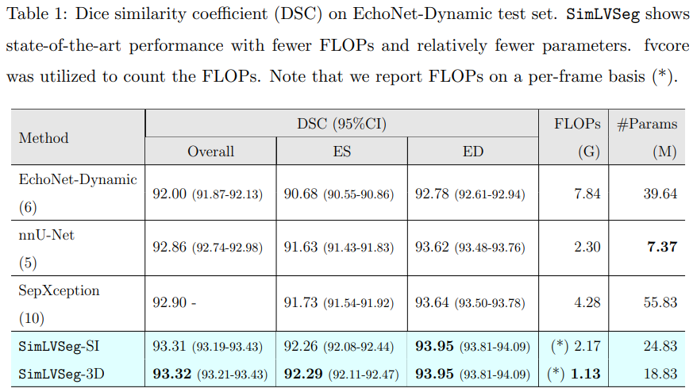

# SimLVSeg: Simplifying Left Ventricular Segmentation in 2D+Time Echocardiograms with Self- and Weakly-Supervised Learning

[Fadillah Adamsyah Maani](https://scholar.google.com/citations?user=W-4975wAAAAJ&hl=en), [Asim Ukaye](https://www.linkedin.com/in/asim-ukaye-2070a73a/), [Nada Saadi](https://www.linkedin.com/in/nada-saadi-440632179/), [Numan Saeed](https://scholar.google.ae/citations?user=VMPEU20AAAAJ&hl=en), [Mohammad Yaqub](https://scholar.google.co.uk/citations?user=9dfn5GkAAAAJ&hl=en)

[](https://arxiv.org/abs/2310.00454)

Official implementation of the paper "SimLVSeg".

## Highlights
### Abstract
> *Echocardiography has become an indispensable clinical imaging modality for general heart health assessment. From calculating biomarkers such as ejection fraction to the probability of a patient's heart failure, accurate segmentation of the heart structures allows doctors to assess the heart's condition and devise treatments with greater precision and accuracy. However, achieving accurate and reliable left ventricle segmentation is time-consuming and challenging due to different reasons. Hence, clinicians often rely on segmenting the left ventricular (LV) in two specific echocardiogram frames to make a diagnosis. This limited coverage in manual LV segmentation poses a challenge for developing automatic LV segmentation with high temporal consistency, as the resulting dataset is typically annotated sparsely. In response to this challenge, this work introduces SimLVSeg, a novel paradigm that enables video-based networks for consistent LV segmentation from sparsely annotated echocardiogram videos. SimLVSeg consists of self-supervised pre-training with temporal masking, followed by weakly supervised learning tailored for LV segmentation from sparse annotations. We demonstrate how SimLVSeg outperforms the state-of-the-art solutions by achieving a 93.32% (95%CI 93.21-93.43%) dice score on the largest 2D+time echocardiography dataset (EchoNet-Dynamic) while being more efficient. SimLVSeg is compatible with two types of video segmentation networks: 2D super image and 3D segmentation. To show the effectiveness of our approach, we provide extensive ablation studies, including pre-training settings and various deep learning backbones. We further conduct an out-of-distribution test to showcase SimLVSeg's generalizability on unseen distribution (CAMUS dataset). The code is publicly available at https://github.com/fadamsyah/SimLVSeg.*
>

### Methodology


### Main Result

| nnU-Net | SimLVSeg w/o SSL | SimLVSeg |
| :------------- | :------------- | :------------- |
|  |  |  |





## Run SimLVSeg

To run this repository, you have to download the EchoNet-Dynamic original dataset.

### Installation
```bash
# Create a conda environment
conda env create -n hc701_fp python=3.8.13 -f environment.yml
```

### Training

The following is the bash script for the self-supervised pretraining with temporal asking. To use a pretrained weight, you have to include an additional argument `--checkpoint`.
```bash
python scripts/seg_3d/seg_3d_masking_train.py \
    --data_path $echonet_dynamic_data_dir \
    --mean 0.12741163 0.1279413 0.12912785 \
    --std 0.19557191 0.19562256 0.1965878 \
    --encoder "3d_unet" \
    --frames 32 \
    --period 1 \
    --mask_ratio 0.6 \
    --num_workers 8 \
    --batch_size 2 \
    --epochs 100  \
    --val_check_interval 0.5 \
    --seed 42
```

The following is the bash script for the weakly-supervised LV segmentation training pipeline. To use a pretrained weight, you have to include an additional argument `--checkpoint`.
```bash
python scripts/seg_3d/seg_3d_train.py \
    --data_path $echonet_dynamic_data_dir \
    --mean 0.12741163 0.1279413 0.12912785 \
    --std 0.19557191 0.19562256 0.1965878 \
    --encoder "3d_unet" \
    --frames 32 \
    --period 1 \
    --num_workers 8 \
    --batch_size 16 \
    --epochs 60  \
    --val_check_interval 0.25 \
    --seed 42
```

### Testing

To do the testing and get the CI of your models, you have to first generate the prediction using the following:
```bash
python scripts/seg_3d/seg_3d_test_get_predictions.py \
    --data_path $echonet_dynamic_data_dir \
    --checkpoint $path_to_your_model_weights \
    --save_dir $prediction_outputs_dir \
    --mean 0.12741163 0.1279413 0.12912785 \
    --std 0.19557191 0.19562256 0.1965878 \
    --encoder "3d_unet" \
    --frames 32 \
    --period 1 \
    --num_workers 4 \
    --batch_size 16 \
    --seed 42
```

Then, run the following code to get the CI for overall, ED, and ES DSC.
```bash
python evaluate_bootstrap.py \
    --data_dir $echonet_dynamic_data_dir \
    --prediction_dir $prediction_outputs_dir \
    --output_dir $evaluation_result_dir \
```

### Inferencing

```bash
python scripts/seg_3d/seg_3d_inference.py \
    --video_path $video_path \
    --save_path $save_path \
    --checkpoint $checkpoint_path \
    --mean 0.12741163 0.1279413 0.12912785 \
    --std 0.19557191 0.19562256 0.1965878 \
    --encoder "3d_unet" \
    --frames 32 \
    --period 1 \
    --num_workers 4 \
    --batch_size 16 \
    --seed 42
```

### CAMUS Out-of-distribution (OOD) Test
You have to first download the preprocessed dataset [here](https://drive.google.com/drive/folders/1uir1SXZzC3Y68f8cL_Nj4drzI4snpzY0?usp=sharing).
```bash
python scripts/camus/seg_3d_test_get_predictions.py \
  --data_path $camus_preprocessed_data_dir \
  --checkpoint $path_to_your_model_weights \
  --save_dir $prediction_outputs_dir \
  --mean 0.12741163 0.1279413 0.12912785 \
  --std 0.19557191 0.19562256 0.1965878 \
  --encoder "3d_unet" \
  --frames 32 \
  --period 1 \
  --num_workers 4 \
  --batch_size 16 \
  --seed 42
```

## Pretrained Weights

We provide training log, best model checkpoint (according to Val DSC), and model checkpoint at the last epoch.

| Model      | SSL      | #Frame | Period | Checkpoint       |
|------------|----------|----------|--------|---------------|
| 3D | ❌ | 32       | 1     | [link](https://drive.google.com/drive/folders/1-NXFFJEX4ieIm8TxPPz5YiFEmglb599N?usp=sharing) |
| 3D | ✔️ | 32       | 1     | [link](https://drive.google.com/drive/folders/1yLD1iqFk0qLb1YWtqVrnYw_23RpYxV0W?usp=sharing) |

## Citation
If you find this repository useful, please consider citing this work:
```latex
@misc{maani2024simlvseg,
      title={SimLVSeg: Simplifying Left Ventricular Segmentation in 2D+Time Echocardiograms with Self- and Weakly-Supervised Learning}, 
      author={Fadillah Maani and Asim Ukaye and Nada Saadi and Numan Saeed and Mohammad Yaqub},
      year={2024},
      eprint={2310.00454},
      archivePrefix={arXiv},
      primaryClass={cs.CV}
}
```